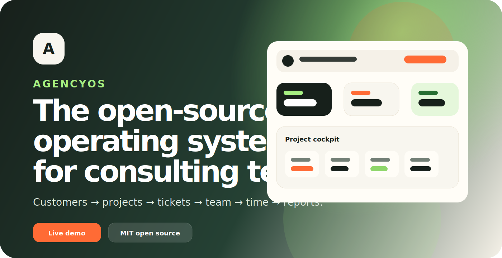
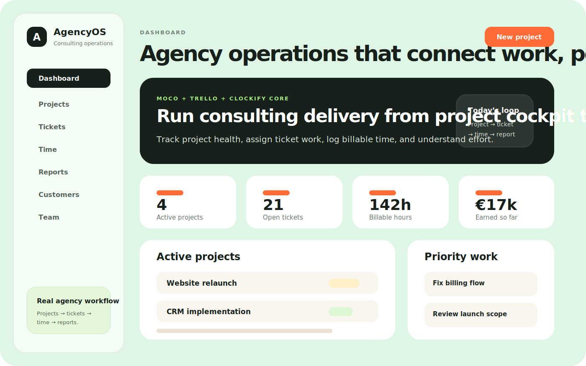
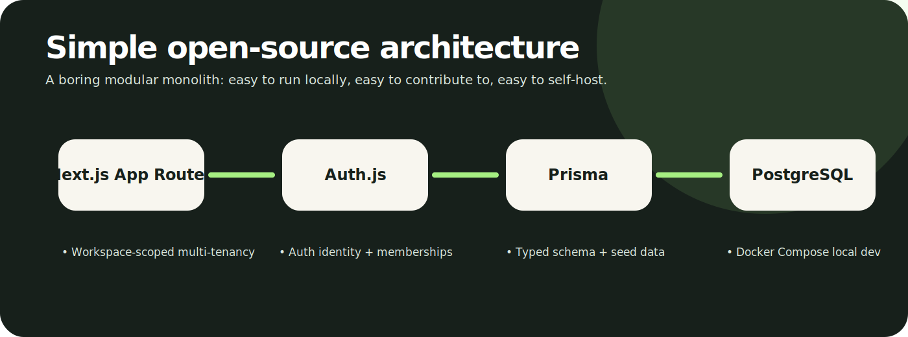

<p align="center">
  
</p>

<p align="center">
  <a href="https://workspace-one-blush-79.vercel.app"><strong>Live demo</strong></a>
  ·
  <a href="docs/product-spec.md">Product spec</a>
  ·
  <a href="docs/implementation-roadmap.md">Roadmap</a>
  ·
  <a href="docs/architecture.md">Architecture</a>
  ·
  <a href="CONTRIBUTING.md">Contribute</a>
</p>

<p align="center">
  <a href="LICENSE"></a>
  
  
</p>

# AgencyOS

AgencyOS is an open-source operating system for small consulting agencies: **customers, projects, tickets, team assignments, time tracking, and reports** in one calm workspace.

It is inspired by focused tools like **MOCO**, **Trello**, and **Clockify** — but built as one open-source product for teams that want delivery clarity without enterprise clutter.

> Status: early public build. AgencyOS now includes a Next.js + Auth.js-ready application shell, while the original Vite/localStorage prototype remains available during the migration.

## Why AgencyOS exists

Consulting teams usually end up stitching together a CRM, task board, spreadsheet, timer, and reporting tool. That creates messy context switching and weak project visibility.

AgencyOS aims to become the simple open-source alternative:

- See every client and project in one place.
- Turn delivery work into tickets.
- Assign work to the right people.
- Track billable/internal time.
- Understand budget burn, utilization, and earned revenue.
- Self-host it when you want control.

## Demo

Live prototype: **https://workspace-one-blush-79.vercel.app**

<p align="center">
  
</p>

<p align="center">
  
</p>

## Current product slice

AgencyOS already includes a real agency workflow prototype:

- **Dashboard** — active projects, open tickets, billable hours, revenue, urgent work, recent time.
- **Projects** — project cockpit with customer, lead, status, budget, board, time, and quick actions.
- **Tickets** — assignable tickets with status, priority, estimate, due date, and description.
- **Board** — Backlog → Todo → In progress → Review → Done.
- **Time** — manual billable/internal time logging against projects and optional tickets.
- **Reports** — project hours, billable hours, earned revenue, and CSV export of the currently filtered time entries for spreadsheet-friendly client and delivery review.
- **Customers** — client accounts connected to delivery.
- **Team** — colleagues, capacity, rates, open tickets, and logged time.
- **Persistence today** — `localStorage` for the prototype.
- **Persistence next** — PostgreSQL + Prisma + Auth.js workspace backend.

## Roadmap

<p align="center">
  
</p>

### Loop 1 — Foundation: auth, workspace, backend persistence

The credibility layer: Next.js shell, PostgreSQL, Prisma, Auth.js, workspace membership, seed/demo data, protected app routes, and database-backed core data.

### Loop 2 — Core CRUD and detail views

Real operational use: create/edit/delete flows, detail drawers/pages, relationship views, assignment updates, validation, loading/error/empty states.

### Loop 3 — Time tracking and operational workflow

Agency-specific depth: start/stop timer, weekly timesheet, time-entry CRUD, ticket activity notes, own time vs workspace time filters.

### Loop 4 — Reporting, onboarding, and polish

Decision-making layer: date filters, customer/project profitability-lite, better dashboards, onboarding, sample workspace, visual polish.

See the full [implementation roadmap](docs/implementation-roadmap.md).

## Architecture direction

<p align="center">
  
</p>

The target architecture is intentionally boring and contributor-friendly:

- **Next.js App Router + TypeScript** for the app shell and server routes.
- **PostgreSQL** as the source of truth.
- **Prisma** for schema, migrations, generated client, and seed data.
- **Auth.js / NextAuth** for authentication.
- **Workspace-scoped multi-tenancy** for teams and organizations.
- **Tailwind + shadcn/Radix-style primitives** as the UI direction.
- **Vitest + Playwright** for confidence.
- **Vercel demo + Docker Compose self-hosting** for distribution.

## Local development

```bash
npm install
npm run dev
```

Then open [http://localhost:3000](http://localhost:3000).

The full legacy prototype remains available at `/prototype` during the migration. If you need to run the old Vite entry directly, use `npm run dev:prototype`.

## Local database foundation

Loop 1 includes a Postgres Docker Compose service and Prisma foundation. The current Vite prototype does not require the database yet, but the next migration work will.

```bash
cp .env.example .env
docker compose up -d postgres
npm run db:validate
npm run db:generate
npm run db:push
npm run db:seed
```

See [local database setup](docs/local-database.md).

## Quality gates

```bash
npm run db:validate
npm run lint
npm run test
npm run build
```

## Project docs

- [Product spec](docs/product-spec.md)
- [Architecture](docs/architecture.md)
- [Tech stack decision](docs/tech-stack-decision.md)
- [Implementation roadmap](docs/implementation-roadmap.md)
- [Development workflow](docs/development-workflow.md)
- [Local database setup](docs/local-database.md)
- [Agentic development system](docs/agents/agentic-system.md)
- [Agentic product loop](docs/agents/product-loop.md)
- [Competitive analysis](docs/competitive-analysis.md)
- [UX product vision](docs/ux-product-vision.md)

## Contributing

AgencyOS is being built in public. Contributions are welcome — especially around:

- Next.js/Auth.js migration
- database-backed CRUD
- project/ticket/time workflows
- reporting and CSV exports
- UX polish and accessibility
- self-hosting docs
- tests and QA automation

Start with [CONTRIBUTING.md](CONTRIBUTING.md), then pick a small issue or propose one.

New contributors can start with the [`good first issue` backlog](https://github.com/kaad01/agencyos/issues?q=is%3Aissue%20is%3Aopen%20label%3A%22good%20first%20issue%22). These issues are intentionally scoped for docs, tests, accessibility, and small UX improvements that support the customer → project → ticket → time → report workflow.

## Principles

- **Agency workflow first** — customers, projects, tickets, team, time, reports.
- **Simple beats clever** — small teams should understand and run it.
- **Open-source friendly** — boring stack, clear docs, useful seed data.
- **Calm UX** — powerful enough for work, not noisy enterprise software.
- **Self-hostable path** — SaaS convenience should not remove ownership.

## License

MIT — see [LICENSE](LICENSE).
